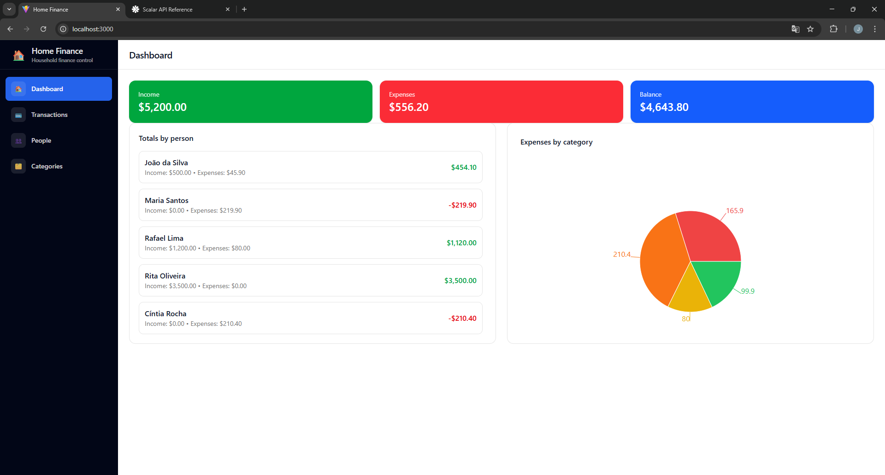
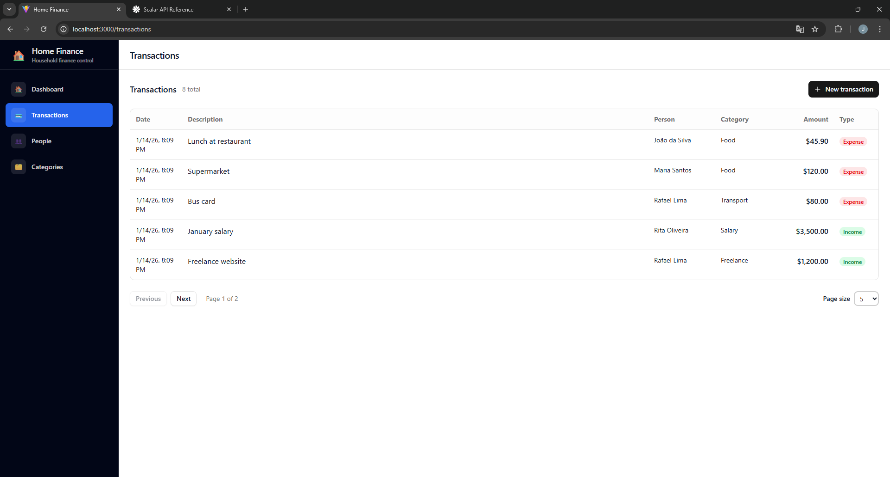
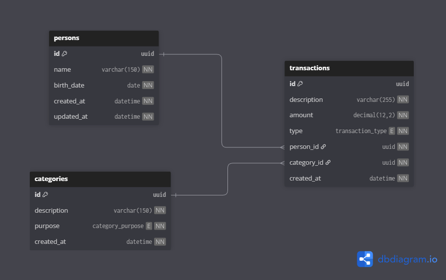

# 💰 Home Finance

Personal finance management system built with **.NET 10**, **React**, and **PostgreSQL**.

The project allows managing **people, categories and financial transactions**, providing a **dashboard with reports and insights** about incomes, expenses and balances.

This project was developed focusing on **clean architecture, business rules, and real-world backend/frontend patterns**.

<div style="display: flex; gap: 8px; align-items: center; margin-top:10px;">        </div>

---

## 📌 Features

* People management
* Categories management (Income, Expense, Both)
* Financial transactions (income and expenses)
* Dashboard with totals and reports
* Reports by person
* Reports by category (pie chart)
* Business rules validation
* Global error handling
* Automatic database migrations
* Dockerized environment

---

## 🏗️ Architecture

The backend follows **Clean Architecture**, separating responsibilities across layers:

* **Api** → HTTP endpoints, middlewares, dependency injection
* **Application** → Use cases, CQRS, validations, reports
* **Core** → Domain entities, business rules, domain exceptions
* **Infra** → Database access, repositories, EF Core, Dapper

### Backend patterns and tools

* **CQRS with Wolverine**
* **FluentValidation** for input validation
* **Centralized exception handlers** (validation, domain and global errors)
* **EF Core** for persistence
* **Dapper** for reporting queries
* **Automatic migrations on startup**

---

## 🎨 Frontend

The frontend is built with **React + Vite**, focusing on a clean UI and maintainable structure.

### Frontend highlights

* **Shadcn/UI** for design system
* **Reusable services** for API communication
* **Global Axios interceptor** for error handling
* **Toast notifications** for feedback
* **Dashboard with cards, tables and charts**
* **Modular pages (People, Categories, Transactions, Dashboard)**

---

## ⚙️ Tech Stack

### Backend

* .NET 10
* ASP.NET Core
* Wolverine (CQRS / Mediator)
* FluentValidation
* Entity Framework Core
* Dapper
* PostgreSQL

### Frontend

* React
* Vite
* TypeScript
* Shadcn/UI
* Sonner (toasts)

### Infrastructure

* Docker
* Docker Compose

---

## 📸 Application Screenshots

### Pages

#### Dashboard 

#### Transactions

#### Categories

#### People


### 🗄️ Database Modeling



---


## 🐳 Running with Docker

### 1️⃣ Create environment file

```bash
cp .env.example .env
```

Fill in the environment variables.

---

### 2️⃣ Build and start containers

```bash
docker compose --env-file .env up --build
```

---

### 📍 Services

| Service    | URL                                            |
| ---------- | ---------------------------------------------- |
| Frontend   | [http://localhost:3000](http://localhost:3000) |
| API        | [http://localhost:5000](http://localhost:5000) |
| PostgreSQL | localhost:5432                                 |

---

## 📂 Project Structure

```
home-finance/
├── api/        # .NET backend (Clean Architecture)
├── web-app/    # React + Vite frontend
├── docker-compose.yml
├── .env.example
└── README.md
```

